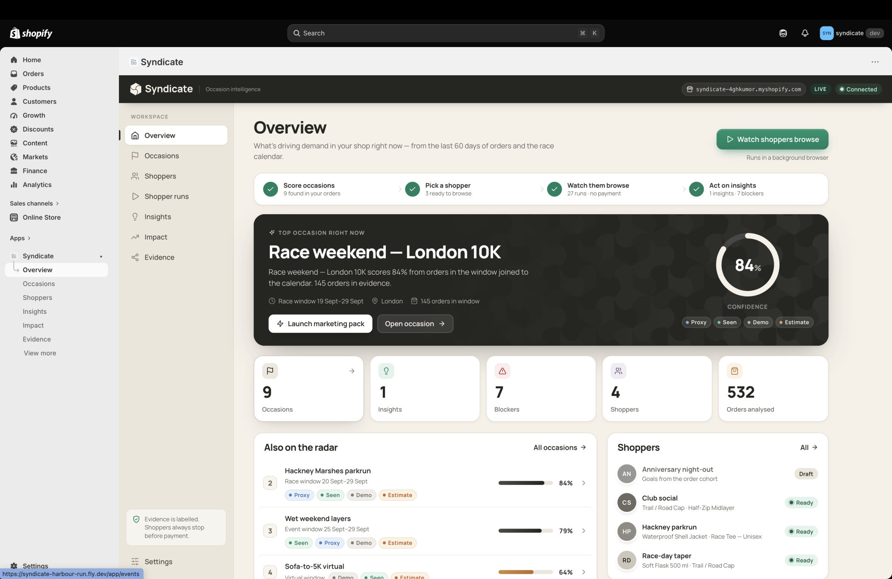
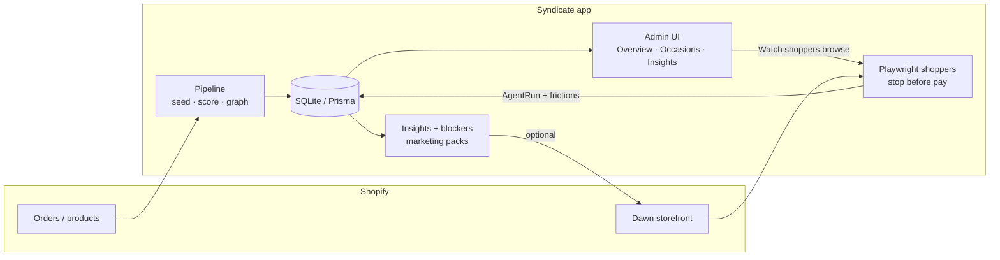

# Syndicate

**Syndicate is occasion-commerce intelligence for Shopify Admin** — it connects why shoppers buy this weekend to whether the storefront is ready, with labelled signals, derived personas, and agents that shop the site and stop before payment.




Syndicate is a Shopify Admin app that answers a simple merchant question: *what real-world occasions are driving demand in my shop right now, and what should I do about them?* Built over a hackathon weekend for the **Harbour Run** demo brand (running / race kit), it joins the last ~60 days of orders to an occasion calendar, scores each candidate with labelled evidence, and surfaces a clear “top occasion” with confidence — for example *Race weekend — London 10K* at 84% from orders in the window joined to the race calendar.

From there, Syndicate derives shopper personas (race-day taper, wet-weather trainer, parkrun regulars, and so on), then sends Playwright “shoppers” through the live storefront in a background browser. Those runs always stop before payment. When they hit friction — missing size guides, weak race-day copy, dead-end filters — the app turns the findings into insights and blockers the merchant can act on, including one-click marketing packs aimed at the winning occasion.

The product lives inside Shopify Admin as an embedded app (Overview, Occasions, Shoppers, Shopper runs, Insights, Impact, Evidence). Evidence is labelled (Proxy / Seen / Demo / Estimate); fixture and live paths stay honest. The PoC is wired end-to-end: Prisma-backed Admin UI, in-process scoring pipeline, real Chromium shopper runs, and optional deploy to [Fly.io](https://syndicate-harbour-run.fly.dev/app).

---

## How it works



1. **Ingest & score** — Orders and catalogue (fixture seed or live Shopify) land in Prisma/SQLite. A pipeline joins them to the race / weather / occasion calendar, builds graph edges, and writes `EventCandidate` rows with confidence bands.
2. **Personas** — Ready shoppers are derived from those occasions (e.g. Race-day taper linked to the London 10K window).
3. **Shopper runs** — On demand, Chromium walks a scripted path on the storefront (`SHOP_STOREFRONT_URL`), never clicks Pay / Shop Pay, and records an `AgentRun`.
4. **Act** — Insights and blockers cite that run; merchants can open evidence, launch a marketing pack, or deploy storefront fixes when write scopes / tokens are present.

| Piece | Stack |
|-------|--------|
| Admin app | Shopify React Router (Remix successor), App Bridge, Polaris-style shell |
| Data | Prisma + SQLite (`EventCandidate`, `GraphEdge`, `AgentRun`, recommendations) |
| Shoppers | Playwright Chromium in-process (headed or headless) |
| Hosting | Optional Fly.io (`syndicate-harbour-run`) with a small volume for SQLite |

Neo4j and Redis are out of scope for this PoC. Street addresses and emails are not stored; geo stays at city / region aggregate.

---

## Quick start (local, no Partner token)

```bash
cd shopify-app
npm install
cp .env.example .env
npx prisma generate && npx prisma migrate deploy
npm run pipeline:demo
npm run dev:demo
```

Open [http://127.0.0.1:44731/app](http://127.0.0.1:44731/app). Details, agent setup, and Fly deploy: [`shopify-app/README.md`](shopify-app/README.md).

Leave `SHOPIFY_API_KEY` / `SHOPIFY_API_SECRET` empty until you link a real Partner app. Never commit `.env` files — only `.env.example` is in git.

---

## Links

- [Product narrative / artifact](https://claude.ai/artifact/XUvvdUU91gmVwhq7zYyjft)
- [Demo walkthrough (Loom)](https://www.loom.com/share/429060b42fc44b33befc85a5547f090c)
- [Live demo (Fly)](https://syndicate-harbour-run.fly.dev/app)
- [App README](shopify-app/README.md)
- [Live demo gate](docs/scope/LIVE_DEMO_GATE.md)
- [Agent kickoff / specs](docs/scope/AGENT_KICKOFF.md)
