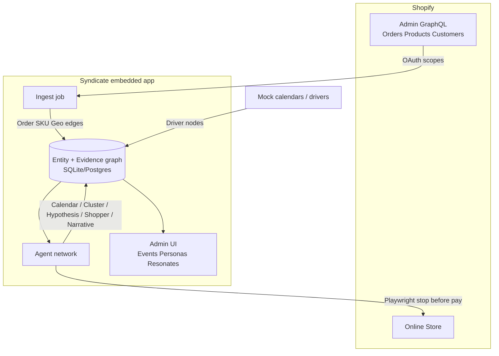

# Syndicate — Planning Brief (Shopify data · Event confidence · Architecture · MVP)

**For:** Austin Weight  
**Product:** Syndicate (Shopify Admin embedded app)  
**Date:** 22 Sep 2026 (BST / Europe/London)  
**Aligned with:** `MVP_ARCHITECTURE.md`, `DEEP_PLAN.md`, `COMBINED_PLAN.md`  
**Ethics:** No individual wealth scoring. Label every signal: `OBSERVED` | `AGGREGATE PROXY` | `MODEL HYPOTHESIS` | `MOCK`.  
**Copy:** British English in any merchant-facing sample text.

**Flag vs prior docs:** This brief **extends** (does not contradict) the existing plans. One refinement: treat `Order.clientIp` as **Admin-available but PCD-gated** (not “needs Web Pixel”); use it only as a coarse geo fallback when shipping address is missing, never as primary identity. ShopifyQL needs `read_reports` **and** Level 2 PCD **and** Admin API ≥ `2025-10`.

---

# 1) ShopifyDataInventory

Sources verified against Shopify Admin GraphQL docs (Order, LineItem, MailingAddress, Customer, Location, AbandonedCheckout, access scopes, protected customer data, ShopifyQL).

## 1.1 Recommended OAuth scopes

### MVP (hackathon / custom / dev store)

```toml
[access_scopes]
scopes = "read_orders,read_products,read_customers"
```

| Scope | Why |
|-------|-----|
| `read_orders` | Orders, line items, fulfillments, abandoned checkouts, `customerJourneySummary` (last **60 days** only) |
| `read_products` | Products, variants, collections, tags, productType, vendor |
| `read_customers` | Customer tags, aggregates, default address when PCD allows |

**Do not request for MVP:** `write_*`, `read_all_orders`, `read_reports`, `write_pixels` / `read_customer_events`, `read_inventory` (unless demo needs stock), `read_locations` (optional if POS / store-location context is shown).

### v1+ (post-hackathon)

| Scope | Why | Gate |
|-------|-----|------|
| `read_all_orders` | History beyond 60 days | Partner approval |
| `read_reports` | `shopifyqlQuery` | Also **Level 2 PCD** |
| `read_locations` | Store / POS / warehouse locations | Optional |
| `read_inventory` | Stock context for friction (“size out of stock”) | Optional |
| `write_pixels` + `read_customer_events` | Browse / session events | Consent + privacy purposes |
| `read_markets` | Multi-market / locale context | Verify Markets queries for API version |

Docs: https://shopify.dev/docs/api/usage/access-scopes · https://shopify.dev/docs/apps/launch/protected-customer-data · https://shopify.dev/docs/apps/build/shopifyql/graphql-admin-api

## 1.2 GDPR / PCD notes (brief)

- **Orders, customers, abandoned checkouts, shipping/billing addresses, email, phone, name** are protected customer data (PCD).
- Public App Store: Level 1 (customer data minus name/address/phone/email) and Level 2 (those fields) need Partner Dashboard request + review. Custom apps: Level 1 always; Level 2 generally always (admin-created may vary by plan). Dev-store-only: select fields in Partner Dashboard; no App Store review.
- Unapproved Level 2 fields return `null` + GraphQL `errors` path explaining redaction.
- UK GDPR / EU GDPR: minimise; prefer city / postcode **sector** / country aggregates; hash customer GIDs; purge on `app/uninstalled`; do not build individual SES scores; merchant-facing insights only (not automated refusal of service).
- Marketing consent: honour `Customer.defaultEmailAddress.marketingState` (and SMS equivalents) if ever messaging; Syndicate MVP is analytics + agents, not outbound marketing.

## 1.3 Inventory tables

### Orders — monetary / status / meta

| Field need | Admin GraphQL (verified) | CAN with normal scopes? | Notes |
|------------|--------------------------|-------------------------|-------|
| Subtotal | `subtotalPriceSet` (MoneyBag shop + presentment) | **CAN** (`read_orders`) | Also `currentSubtotalPriceSet` after returns |
| Tax | `totalTaxSet`, `taxLines`, `currentTotalTaxSet` | **CAN** | `taxesIncluded` boolean |
| Shipping | `totalShippingPriceSet`, `shippingLine(s)`, `currentShippingPriceSet` | **CAN** | |
| Discounts | `totalDiscountsSet`, `currentTotalDiscountsSet`, `cartDiscountAmountSet`, `discountCodes`, `discountApplications` | **CAN** | Order-level + line allocations on LineItem |
| Currency | `currencyCode` (shop), `presentmentCurrencyCode` | **CAN** | MoneyBag has both |
| Timestamps | `createdAt`, `processedAt`, `updatedAt`, `cancelledAt`, `closedAt` | **CAN** | Prefer `processedAt` for demand timing |
| Financial status | `displayFinancialStatus` | **CAN** | paid / pending / authorised / refunded / … |
| Fulfillment | `displayFulfillmentStatus`, `fulfillments`, `fulfillmentOrders` | **CAN** | |
| Tags | `tags` | **CAN** | |
| Note | `note` | **CAN** | Max 5000 chars |
| Custom attrs | `customAttributes` | **CAN** | Cart / note attributes analogue |
| Source / channel | `sourceName`, `app`, `publication`, `retailLocation` | **CAN** | web / pos / draft / app name |
| Test flag | `test` | **CAN** | Exclude from analytics |

Docs: https://shopify.dev/docs/api/admin-graphql/latest/objects/Order

### Orders — line items

| Field need | GraphQL | CAN? | Notes |
|------------|---------|------|-------|
| SKU | `lineItems.sku` | **CAN** | May be null |
| Product / variant | `product`, `variant`, `title`, `variantTitle`, `name`, `vendor` | **CAN** | Join Product for type/tags/collections |
| Qty | `quantity`, `currentQuantity` | **CAN** | |
| Unit / line price | `originalUnitPriceSet`, `discountedUnitPriceSet`, `originalTotalSet`, `discountedTotalSet`, `totalDiscountSet` | **CAN** | Prefer MoneyBag `*Set` fields |
| Line tax | `taxLines` | **CAN** | |
| Line custom attrs | `customAttributes` | **CAN** | |

Docs: https://shopify.dev/docs/api/admin-graphql/latest/objects/LineItem

### Location / geo

| Field need | Source | CAN / CANNOT / needs pixel |
|------------|--------|----------------------------|
| Shipping address city, province, country, zip | `Order.shippingAddress` → `MailingAddress` (`city`, `province`/`provinceCode`, `country`/`countryCodeV2`, `zip`) | **CAN** with `read_orders` + **PCD Level 2 Address** (street `address1`/`address2` also L2 — **do not store** for MVP) |
| Billing address | `Order.billingAddress` | Same as shipping |
| Display address | `displayAddress` (shipping preferred) | Same |
| Lat/lng on address | `MailingAddress.latitude` / `longitude` | **CAN** when address present + PCD; treat as OBSERVED geocode of **ship-to**, not venue |
| Customer default address | `Customer.defaultAddress` | **CAN** with `read_customers` + PCD L2 Address |
| Order client IP | `Order.clientIp` | **CAN** in Admin API with PCD; **null** for POS/API/draft; **not** a Web Pixel requirement. Coarse geo only; label OBSERVED IP, never individual profiling |
| Browser session geo / path heatmap | Web Pixel / Customer Events | **Needs pixel** (`write_pixels`, `read_customer_events`) + consent |
| Store / POS locations | `Location` (`read_locations` or `read_inventory` / `read_markets_home`); `Order.retailLocation` on POS orders | **CAN** for merchant locations; not customer home geo |
| Pre-purchase browse sessions (full) | Not in Admin without pixels | **Needs pixel** (or limited `customerJourneySummary` on **completed** orders only) |

MailingAddress: https://shopify.dev/docs/api/admin-graphql/latest/objects/MailingAddress · Location: https://shopify.dev/docs/api/admin-graphql/latest/objects/Location

### Customer

| Field need | GraphQL | CAN? | Notes |
|------------|---------|------|-------|
| Name | `firstName`, `lastName`, `displayName` | PCD **Level 2 Name** | Prefer not to use in analytics warehouse |
| Email | `defaultEmailAddress.emailAddress` (legacy `email` deprecated) | PCD **Level 2 Email** | Hash or drop for Syndicate analytics |
| Phone | `defaultPhoneNumber` (legacy `phone` deprecated) | PCD **Level 2 Phone** | Same |
| Order history aggregates | `numberOfOrders`, `amountSpent`, `orders`, `lastOrder`, `statistics` | **CAN** (`read_customers` + orders access); PCD applies to nested orders | Good for persona “repeat vs first” without wealth |
| Tags | `tags` | **CAN** | OBSERVED merchant tags |
| Metafields | `metafield` / `metafields` | **CAN** on owner with resource access | Prefer app-owned namespace for write-backs later |
| Email marketing consent | `defaultEmailAddress.marketingState`, `marketingOptInLevel`, `marketingUpdatedAt` | **CAN** (`read_customers`) + PCD for email value | Legacy `emailMarketingConsent` deprecated |
| Order-time marketing flag | `Order.customerAcceptsMarketing` | **CAN** | Snapshot at purchase |
| Data sale opt-out | `dataSaleOptOut` | **CAN** | Honour for any sharing |

Docs: https://shopify.dev/docs/api/admin-graphql/latest/objects/Customer · https://shopify.dev/docs/api/admin-graphql/latest/objects/CustomerEmailAddress

### Products / collections / inventory

| Need | Scope / object | CAN? |
|------|----------------|------|
| Catalogue title, type, vendor, tags, status | `read_products` → Product | **CAN** (not PCD) |
| Variants, SKU, price, options | ProductVariant | **CAN** |
| Collections membership | Collection + product collections | **CAN** |
| Inventory quantities | `read_inventory` → InventoryLevel / InventoryItem | **CAN** but **optional**; cut from MVP unless friction demo needs OOS |

### Analytics / ShopifyQL / abandonment / sessions

| Need | Reality |
|------|---------|
| ShopifyQL / Admin reports API | **CAN** via `shopifyqlQuery` with `read_reports` + **Level 2 PCD** + API version ≥ `2025-10`. Heavy for hackathon — prefer in-app aggregation of Orders. https://shopify.dev/docs/apps/build/shopifyql/graphql-admin-api |
| Abandoned checkouts | **CAN** with `read_orders` (+ staff permission `manage_abandoned_checkouts`); PCD applies. Fields include line items, shipping/billing country, recovery URL, timestamps. **Out of MVP** but useful Tier 1. https://shopify.dev/docs/api/admin-graphql/latest/objects/AbandonedCheckout |
| Session / browse without Plus or pixels | **Limited:** on **completed** orders only, `customerJourneySummary` (`firstVisit` / `lastVisit` / `moments`, daysToConversion) with `read_orders`. **No** full site session stream, funnel heatmaps, or anonymous browse without Web Pixel + consent. Not Shopify Plus-gated for AbandonedCheckout/CustomerJourneySummary, but pixels are a separate install + consent path. |
| Individual wealth / credit | **CANNOT** — does not exist in Shopify. Do not invent. |

### Summary: CAN / CANNOT / needs pixel

| CAN (normal Admin app + scopes; PCD as noted) | CANNOT | Needs Web Pixel / Customer Events |
|-----------------------------------------------|--------|-------------------------------------|
| Order money, lines, tags, note, channel, fulfillment, ≤60d | Orders >60d without `read_all_orders` approval | Full anonymous browse paths |
| Ship/bill city–province–country–zip (+ lat/lng) with PCD L2 | Street-level storage recommended against | Live session replay |
| Customer tags, order counts, amountSpent | Individual SES / wealth | Pre-purchase product-view streams |
| Products, collections, taxonomy | Cross-merchant identity graph | Consent-gated behavioural pixels |
| AbandonedCheckout (Tier 1+) | Guaranteed IP on POS/draft | |
| customerJourneySummary on orders | ShopifyQL without `read_reports`+L2 PCD | |
| clientIp on browser checkouts (PCD) | | |

---

# 2) EventDriverConfidenceModel

## 2.1 Goal

For a merchant vertical (sport kit / fashion occasion), build a map of **drivers** that may explain demand, attach **evidence** from Shopify orders (OBSERVED) + calendars/enrichment (labelled), and score **confidence %** that lift is attributable to Event A vs Event B vs baseline.

## 2.2 Driver catalogue (examples)

| Driver type | Example sources | Provenance default |
|-------------|-----------------|--------------------|
| Sports fixtures | League calendars (e.g. football-data.org), club home venues | MOCK or OBSERVED calendar ingest |
| Local festivals / cultural | Curated JSON; later licensed feeds | MOCK → OBSERVED |
| Weather spikes | External weather API by city/region | AGGREGATE PROXY |
| Pay-day patterns | Heuristic (e.g. last Fri / 25th–28th) × country | MODEL HYPOTHESIS |
| Influencer / drop dates | Merchant metafields or CSV upload | OBSERVED if merchant-supplied |
| School holidays | Regional education calendars | AGGREGATE PROXY / MOCK |
| Area socioeconomic strata | UK IMD via postcode→LSOA; US ACS via ZCTA | **AGGREGATE PROXY only** — never individual wealth |

## 2.3 Proximity (ship-to vs venue)

1. Resolve order geo: prefer `shippingAddress` city/postcode/country → lat/lng (OBSERVED). Fallback: billing → customer default → (last) `clientIp` coarse geo (weak).
2. Resolve event venue geo: calendar venue city / stadium coordinates (calendar provenance).
3. Distance bands (hackathon defaults):

| Band | Distance | Weight |
|------|----------|--------|
| `venue_local` | ≤25 km | 1.0 |
| `metro` | ≤80 km | 0.7 |
| `region` | same NUTS/ITL / state | 0.4 |
| `national` | same country only | 0.2 |
| `none` | else | 0.0 |

4. Digital/event-agnostic orders (no shipping): use `customerLocale` / market country only; geo weight capped at `national`.

## 2.4 Practical confidence scoring (hackathon heuristic)

For each candidate event \(E\) and order cohort in window \(W\):

\[
C(E) = 100 \times \mathrm{clip}_{0,1}\big(
  0.30\,L_t + 0.25\,G + 0.25\,A + 0.10\,Y + 0.10\,R
\big)
\]

| Component | Meaning | How to compute (MVP) |
|-----------|---------|----------------------|
| \(L_t\) Temporal lift | Orders in \(W\) vs baseline | Baseline = median same weekday × prior 4–6 weeks (or same DOW within 60d). Lift = \((n_W - b)/\max(b,1)\); map lift 0→0, ≥1.0→1.0 |
| \(G\) Geo overlap | Share of orders in proximity bands | Weighted mean of band weights for orders in \(W\) |
| \(A\) Catalogue affinity | Basket match to event type | Keyword/tag/productType/collection rules (kit, scarf, matchday, festival, occasionwear). Fraction of line items matching |
| \(Y\) Prior-year / prior fixture | Same fixture or same calendar slot | If prior year data missing (60d window): set \(Y=0.5\) neutral **or** mark MOCK “assumed recurrent” — **flag in UI** |
| \(R\) Residual / competition | After subtracting other events + seasonality | If second event overlaps same day, split residual by affinity; else \(R = 1 -\) normalised residual noise |

**Multi-event day:** Softmax-normalise \(C(E_i)\) so Event A + Event B + Baseline ≈ 100%. Baseline gets remainder when no event clears threshold (e.g. raw \(C < 25\)).

**Minimum sample:** If \(n_W < 5\) orders, cap displayed confidence at 40% and label `MODEL HYPOTHESIS (low n)`.

## 2.5 Output entities

```text
EventCandidate {
  id, shopId, name, archetype,  // match_day | festival | ...
  timeStart, timeEnd,
  venueGeo?,                     // lat/lng or city
  driverIds[],
  confidence: ConfidenceScore,
  enrichmentSource               // orders_only | orders_plus_calendar | orders_plus_mock
}

Driver {
  id, type,                      // fixture | festival | weather | payday | drop | school_holiday | strata
  label, externalRef?,
  provenance                     // OBSERVED | AGGREGATE PROXY | MODEL HYPOTHESIS | MOCK
}

EvidenceEdge {
  fromType, fromId,              // Order | EventCandidate | Driver | SKU | Geo | Persona
  toType, toId,
  relation,                      // SHIPPED_TO | AFFINITY | TEMPORAL_LIFT | GEO_OVERLAP | ...
  weight,
  provenance,
  payload?                       // e.g. distance_km, lift_ratio
}

ConfidenceScore {
  valuePct: 0..100,
  components: { Lt, G, A, Y, R },
  competing: [{ eventId, valuePct }],
  baselinePct,
  provenanceLabels: string[],    // e.g. ["OBSERVED orders", "MOCK fixtures"]
  nOrders, window
}
```

Personas remain as in `MVP_ARCHITECTURE.md` / `DEEP_PLAN.md`, linked via `Persona→EventCandidate` edges.

---

# 3) RecommendedArchitecture (hybrid)

## 3.1 Recommendation

**Hybrid: lightweight graph of entities/evidence + specialised agents for ingest, hypothesis, shopper runs, and narrative.**  
Not agents-only; not graph-only.

## 3.2 What should be a graph

| Nodes | Edges |
|-------|-------|
| Order, LineItem/SKU, Product, Collection | Order→SKU, Order→Geo, Order→Customer(hash), Order→Channel |
| Geo (city/sector/country), Venue | Event→Venue, Order→Geo (SHIPPED_TO) |
| EventCandidate, Driver | Event→Driver, Event→SKU affinity, EvidenceEdge weights |
| Persona | Persona→Event, Persona→SKU goals |
| Affordance / Insights artifacts | PersonaRun→SitePart scores |

Graph answers: “which SKUs co-occur with Event A near Venue V?” and supports explainable confidence paths.

## 3.3 What agents do under the hood

| Agent | Job | Writes |
|-------|-----|--------|
| Calendar ingest | Fetch/mock fixtures, holidays | Driver nodes (labelled) |
| Clustering / spike | Temporal×geo×catalogue heuristics | EventCandidate + EvidenceEdges |
| Hypothesis / naming | LLM on **aggregated non-PII** cards | Event/Persona names (`MODEL HYPOTHESIS`) |
| Shopper runs | Playwright persona browse → cart/checkout start | AffordanceScore, InsightScore |
| Narrative | British English merchant cards | Dashboard copy |

Agents **mutate and query** the graph; they are not a substitute for storing relations.

## 3.4 Storage options

| Option | Hackathon | Production |
|--------|-----------|------------|
| In-memory graph (Maps + adjacency lists) | ✅ Fastest | ❌ |
| SQLite (tables + recursive CTEs / JSON edges) | ✅ Fits Remix template | Dev only |
| Postgres + recursive CTEs / `ltree` / edge table | Good bridge | ✅ Solid default |
| Neo4j / Memgraph | Overkill day-1 | Optional if query patterns explode |
| Agents-only (prompt each time) | ❌ Non-reproducible | ❌ |
| Graph-only (no agents) | Misses shopper UX + naming | Incomplete product |

## 3.5 Why not agents-only / graph-only

- **Agents-only:** No durable evidence, no reproducible confidence %, hard GDPR audit, expensive re-runs, hallucinated edges.
- **Graph-only:** No calendar fetch, no LLM naming UX, no Playwright “resonates / doesn’t” — the product’s differentiator vs enrichment apps.

## 3.6 Diagram

> **SUPERSEDED (26 Sep 2026):** This legacy diagram is retained for historical context only; its football/older architecture framing is not the current primary flow. The current SoT is [`scope/FLOWS.md`](./scope/FLOWS.md), centred on Harbour Run / running, Prisma Admin and real headed Playwright.




ASCII (same):

```
Shopify Admin API ──► Ingest ──► [Graph: Order→SKU→Geo→Event←Driver]
Mock calendars ─────────────────►┘              ▲
                                               │
                    Agents: cluster · name · shop · narrate
                                               │
Online Store ◄──── Playwright personas ────────┘
                                               ▼
                                    Dashboard (Polaris)
```

---

# 4) MVPSlice (1 day — confidence-mapped events)

**Demo goal:** Real Shopify order fields + **mocked** calendars → 2–3 EventCandidates with confidence breakdown → 2–3 Personas → 2–3 shopper runs → Resonates / Doesn’t.

### Build

1. Embedded app (CLI React Router / Remix) + scopes `read_orders,read_products,read_customers`.
2. Backfill ≤60d orders: `processedAt`, MoneyBag totals, lineItems (sku/qty/prices/product), `shippingAddress { city provinceCode countryCodeV2 zip }`, `tags`, `sourceName`, `displayFinancialStatus` (dev store PCD OK).
3. Load products/collections for affinity dictionary.
4. Seed **MOCK** fixture + bank-holiday JSON (label in UI).
5. Heuristic scorer → persist EventCandidate + ConfidenceScore components + EvidenceEdges in SQLite.
6. Derive 2–3 Personas from top baskets (goals/budget from AOV bands — not income).
7. Playwright: home → collection → PDP → ATC → checkout start; stop before payment.
8. Polaris tables: Events (confidence %), Personas, Resonates / Insights; provenance badges.

### Cut

Pixels, ShopifyQL, `read_all_orders`, AbandonedCheckout deep dive, real IMD join (or optional MOCK strata), Neo4j, real checkout, wealth APIs, App Store polish.

### Sample merchant-facing copy (British English)

> “We think **Match day — home kit rush** drove about **68%** of Saturday’s lift in Greater Manchester (observed orders + mock fixture calendar). Baseline still explains the rest. Labels: OBSERVED orders · MOCK fixtures.”

---

# 5) OpenQuestions for Austin Weight

1. **Vertical for demo:** Premier League kit shop vs fashion occasion — which calendar to mock first?
2. **Dev store:** Already have one with realistic orders + shipping cities, or need fixture CSV seed?
3. **PCD stance for pitch:** Stay on custom/dev (full address) or show redacted public-app path?
4. **Confidence UI:** Show component breakdown (lift / geo / affinity) or single % only for judges?
5. **Prior-year \(Y\)**: Accept neutral 0.5 within 60d window, or mock prior-year series labelled MOCK?
6. **Strata:** Skip IMD entirely for day-1, or one MOCK “area affluence band” card clearly labelled?
7. **Agent depth:** Cart-only vs checkout-start; any screenshot capture if time?
8. **Post-hackathon:** Priority of `read_all_orders` vs pixels vs AbandonedCheckout?
9. **Graph store:** Confirm SQLite-in-template vs bring Postgres?
10. **Naming:** Keep “Syndicate” for pitch deck?

---

## Source index (primary)

- Access scopes: https://shopify.dev/docs/api/usage/access-scopes  
- Protected customer data: https://shopify.dev/docs/apps/launch/protected-customer-data  
- Order: https://shopify.dev/docs/api/admin-graphql/latest/objects/Order  
- LineItem: https://shopify.dev/docs/api/admin-graphql/latest/objects/LineItem  
- MailingAddress: https://shopify.dev/docs/api/admin-graphql/latest/objects/MailingAddress  
- Customer / CustomerEmailAddress: https://shopify.dev/docs/api/admin-graphql/latest/objects/Customer · …/CustomerEmailAddress  
- Location: https://shopify.dev/docs/api/admin-graphql/latest/objects/Location  
- AbandonedCheckout: https://shopify.dev/docs/api/admin-graphql/latest/objects/AbandonedCheckout  
- CustomerJourneySummary: https://shopify.dev/docs/api/admin-graphql/latest/objects/CustomerJourneySummary  
- ShopifyQL for apps: https://shopify.dev/docs/apps/build/shopifyql/graphql-admin-api  
- Web pixels: https://shopify.dev/docs/apps/build/marketing/build-web-pixels  

**Companion local docs:** `MVP_ARCHITECTURE.md`, `DEEP_PLAN.md`, `COMBINED_PLAN.md`  

**End of planning brief.**
