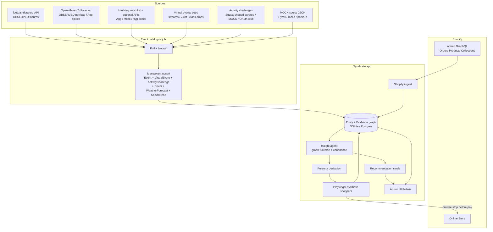

# Syndicate — Sports + Athleisure Event Graph Pipeline

**Product:** Syndicate (occasion-commerce intelligence Shopify app)  
**Owner:** Austin Weight  
**Vertical focus:** Sports brands + athleisurewear (start)  
**Date:** 22 Sep 2026 (BST / Europe/London)  
**Aligned with:** `PLANNING_BRIEF_SHOPIFY_EVENTS.md`, `MVP_ARCHITECTURE.md`, `DEEP_PLAN.md`, `COMBINED_PLAN.md`  
**Ethics:** Label every signal `OBSERVED` | `AGGREGATE PROXY` | `MODEL HYPOTHESIS` | `MOCK`. No individual wealth scoring.  
**Copy:** British English in merchant-facing sample text.  
**Research note:** URLs/APIs below were checked via public docs and live HEAD/GET probes on 22 Sep 2026. Uncertain or ToS-risky sources are flagged.


> **SUPERSEDED as weekend SoT (26 Sep 2026).** Product vertical for the hackathon PoC is **Harbour Run / running** — not football kits as primary. Do **not** implement from this file alone.  
> **SoT now:** [`scope/WEEKEND_BUILD_SPEC.md`](./scope/WEEKEND_BUILD_SPEC.md) · [`scope/AGENT_KICKOFF.md`](./scope/AGENT_KICKOFF.md) · [`scope/LIVE_DATA_WIRE.md`](./scope/LIVE_DATA_WIRE.md) · [`scope/RUN_AGENTS_UI_CONTRACT.md`](./scope/RUN_AGENTS_UI_CONTRACT.md) · [`scope/LIVE_DEMO_GATE.md`](./scope/LIVE_DEMO_GATE.md) · [`live-demo-store/`](./live-demo-store/) · epics 01–09.  
> Football / match-day content below is **historical / optional secondary catalogue** only. Kept for research context — do not re-litigate D26–D32.

---

## Positioning (sports slice)

**One-liner:** Discover crawlable sports occasions (race weekends, fixtures, functional-fitness meets, **local weather forecasts**, **trending hashtags / social buzz**, virtual challenges), keep a fresh event catalogue, traverse a graph into personas and synthetic shoppers, then push merchandising recommendations.

**Pitch line:** Stop guessing race-week merch. Watch your store shop itself as the runners and CrossFitters who actually buy.

This doc **extends** the existing hybrid graph + agents architecture. It specialises Event / Driver discovery for **sports + athleisure**, without contradicting the Shopify ingest, confidence model, or ethics rules in the planning brief.

---

# 1) Vertical scope — sports + athleisure

## 1.1 In for MVP (hackathon demo vertical)

| Segment | Merchant archetype | Why in |
|---------|-------------------|--------|
| Running specialty | Road / trail / parkrun-adjacent kit shop | Dense UK calendar; clear trainer / layer / recovery baskets |
| Athleisure fashion-adjacent | Yoga / studio / lifestyle brand selling leggings, bras, jackets | Weather + virtual challenges drive layer and drop demand |
| Functional fitness retail | CrossFit / Hyrox / “Cross Rox”-style kit (grips, ropes, shoes) | High intent around competition weekends |
| Premier League / football kit retail | Club or multi-club kit shop | Match-day spikes already in Syndicate pitch; football-data.org is live-API friendly |

## 1.2 In for later (post-hackathon Tier 1+)

| Segment | Notes |
|---------|-------|
| CrossFit boxes as merchants | Local affiliate geo × Games calendar; affiliate map endpoints exist but ToS unclear |
| Cycling / triathlon specialty | Active.com strong; UK calendars weaker for free APIs |
| Outdoor / adventure athleisure | Festival + weather drivers; overlaps fashion occasion vertical |
| Youth / junior sport | parkrun junior series; school-holiday Driver already in brief |
| Multi-market US running | Active.com primary; UK-first demo stays cleaner for GDPR narrative |

## 1.3 Out of MVP (explicit cuts)

- Individual athlete enrichment, **private** Strava athlete activities / stalking, wealth/SES scoring  
- Scraping parkrun **results** pages (ToS risk; catalogue list is separate — see §3)  
- Completing checkout / creating real orders via agents  
- Licensed Premier League club crest rights as a product feature (merchants already sell licensed kit; we only correlate fixtures)  
- Real-time odds / betting feeds  
- Full Neo4j production graph (SQLite/Postgres edge table remains the default)

---

# 2) Event taxonomy

Each category maps to **drivers** (causal signals) and **merch effects** (SKU / collection / campaign hypotheses). Provenance defaults follow the ethics labels.

| Category | Example drivers | `mode` (physical / virtual / hybrid) | Merch effects (examples) | Provenance default |
|----------|-----------------|--------------------------------------|--------------------------|--------------------|
| `race_running` | Half marathon, 10K, trail ultra, local race weekend | Usually `physical` | Trainers, race belts, gels, technical tees, blister care, post-race recovery | OBSERVED calendar or MOCK |
| `team_fixture` | Premier League match day, Championship, Champions League; watch-party streams | `physical` (+ optional companion `virtual`/`hybrid` VirtualEvent) | Home/away kit, scarves, layers for stand weather, kids kit | OBSERVED API preferred |
| `competition_meet` | Athletics meeting, swim meet, gymnastics open | `physical` | Specialist footwear, leotards, warm-up layers | MOCK for MVP |
| `crossfit_functional` | CrossFit Games licensed events, affiliate comps, Hyrox city races, **online qualifier windows** | `physical` / `hybrid` / `virtual` | Rope grips, lifting shoes, shorts, knee sleeves, chalk bags | MOCK + optional paid Hyrox API |
| `virtual_challenge` | Virtual Runner-style distance challenges, app-only races, **Zwift-style rides**, **Strava monthly challenges**, Peloton/class drops, live fitness streams | `virtual` (or `hybrid` if tied to IRL weekend) | Same kit as race but ship-to anywhere; recovery packs; “finishers” merch; class-drop athleisure | MOCK curated / optional public calendar; activity buzz AGGREGATE_PROXY |
| `weather_driver` | Cold snap, heatwave, heavy rain, wind spike by city | N/A (Driver, not Event — see §4.5) | Jackets, base layers, waterproofs, summer tanks, hydration | AGGREGATE PROXY (Open-Meteo) |
| `season_drop_calendar` | Autumn layer drop, Black Friday athletic, marathon season capsule, studio class drops | Campaign / merchant-defined (`virtual` when online-only drop) | Collection pins, homepage hero, email timing | OBSERVED if merchant metafield/CSV; else MOCK |

### Event.mode (first-class — D31)

`physical` · `virtual` · `hybrid` — stored on CatalogueEvent / VirtualEvent / ActivityChallenge. UI chips: **Physical** / **Virtual** / **Hybrid**. `virtualFlag` remains derived (`mode !== physical`) for legacy loaders. Catalogue job + Events list filter by `mode`.

**Virtual geo:** audience GeoBuckets from store order cities **plus** optional synthetic GeoBucket **`global/virtual`**.

### Audience tags (on Event nodes)

`elite` · `amateur_competitive` · `recreational` · `family` · `junior` · `fan_spectator` · `studio` · `online_only`

### Sample British English merchant copy

> “We think **Race weekend — Greater Manchester 10K** drove about **62%** of Saturday’s lift in running trainers and recovery foam rollers (observed orders + live football/race calendars where labelled). Cold snap drivers explain the jacket spike separately. Labels: OBSERVED orders · OBSERVED fixtures · AGGREGATE PROXY weather · MOCK Hyrox weekend.”

---

# 3) Crawlable sources inventory

**Honesty rule:** Prefer official APIs / documented feeds. If HTML-only or ToS-hostile, mark **MOCK for hackathon** and do not scrape in the demo path.

| # | Name | URL / endpoint | Phys / virt | Fields available | Crawl method | Legal / ToS caution | Reliability | MVP? |
|---|------|----------------|-------------|------------------|--------------|---------------------|-------------|------|
| 1 | **football-data.org** | `https://api.football-data.org/v4/competitions/{code}/matches` · docs: https://docs.football-data.org/ | Physical | Match id, UTC date, status, home/away teams, competition, score (delayed on free) | **API** (register free token; header `X-Auth-Token`) | Free tier: ~10 req/min, subset of competitions (incl. PL). Attribution per their policies. | High for fixtures | **YES — live crawl #1** |
| 2 | **Open-Meteo Forecast** | `https://api.open-meteo.com/v1/forecast` · docs: https://open-meteo.com/en/docs | Driver | Temp, precip, wind, weather code by lat/lng; daily/hourly | **API** (no key for non-commercial) | Free = **non-commercial** + CC BY 4.0 + rate limits (10k/day). Commercial product needs paid plan. Hackathon OK if attributed; production → paid. | High | **YES — live Driver #2** |
| 3 | **Open-Meteo UKMO models** | https://open-meteo.com/en/docs/ukmo-api | Driver | UK Met Office UKV/Global via Open-Meteo | **API** | UKMO data via Open-Meteo often CC BY-SA; attribute. Met Office **DataPoint retired 1 Dec 2025** — do not plan on DataPoint. | High | Optional (same pipeline as #2) |
| 4 | **parkrun events.json** | `https://images.parkrun.com/events.json` (verified HTTP 200, ~900KB GeoJSON, refreshed frequently) | Physical (weekly recurring) | Event name, shortName, coordinates, seriesid, country | **JSON GET** (not an official public API) | parkrun publishes anti-scraping guidance (`parkrun.com/scraping`); official API long on hold. **Community-known CDN JSON is fragile and ToS-ambiguous.** Do **not** scrape results pages. | Medium (CDN can move) | **NO live scrape for MVP** — optional later with permission; use **MOCK weekly parkrun geo** for demo |
| 5 | **England Athletics RunEvents** (ex-runbritain) | https://www.englandathletics.org/runevents/ · legacy list https://runbritain.equatedigital.com/races | Physical / some virtual | Race name, date, distance, county (HTML) | **HTML** (no documented public API found) | Respect robots/ToS; licensing site not an open data feed | Low for automation | **MOCK** race weekends |
| 6 | **Find a Race** | https://findarace.com/events | Physical + virtual | Title, dates, location, price (HTML) | **HTML** | Commercial listings site; no public API found | Low | **MOCK** |
| 7 | **Race Calendar UK** | https://racecalendar.co.uk/events-feed | Physical | Embeddable feed (paid API key / widget) | **Paid embed/API** | Paid; not free crawl | Medium if subscribed | Later; **MOCK** for day-1 |
| 8 | **Active.com Activity Search v2** | `http://api.amp.active.com/v2/search` · docs: https://developer.active.com/docs/v2_activity_api_search | Mostly physical (US-heavy) | Name, dates, place geo, topics (running), registration URLs | **API** (requires free key; 2 rps / 500k/day) | Apply for key; follow Active Network terms | High (US); weaker UK coverage | **Optional live** if US demo; else MOCK |
| 9 | **Ahotu** | https://www.ahotu.com/ | Physical global races | Calendar HTML | **HTML** | No public API found in research | Low | **MOCK** |
| 10 | **CrossFit Games competitions** | https://games.crossfit.com/competitions · community notes of `/competitions/api/v1/...` | Physical + online Open | Licensed event schedule (HTML; API **unverified for production use**) | HTML / **uncertain API** | Unofficial endpoints may break; no stable public docs found this pass | Uncertain | **MOCK** CrossFit / “Cross Rox” meets for MVP |
| 11 | **CrossFit affiliate map** | Community: `map.crossfit.com/getAllAffiliates.php`; also `crossfit.com/.../affiliates.json` (AllThePlaces spider) | Geo of boxes (not timed events) | Lat/lng, name, id | **JSON** (undocumented) | Undocumented; ToS risk | Fragile | Later geo enrichment only; **not** Event catalogue MVP |
| 12 | **Hyrox Result API** | https://hyroxresultapi.com/ · `GET /api/v1/races`, `/events` | Physical | Race calendar (city, country, dates, tickets), divisions, results | **Paid API** (Bearer token; Starter 30 rpm) | Third-party aggregator; subscription required | High if paid | **MOCK** for hackathon; production candidate |
| 13 | **Sync2Cal Hyrox iCal** | https://www.sync2cal.com/sports/hyrox | Physical | Calendar subscription | **iCal** (third-party) | Verify Sync2Cal ToS/redistribution | Medium | Optional; prefer MOCK if unclear |
| 14 | **Strava** | https://developers.strava.com/docs/reference/ | Virtual / activity | Clubs, challenges (limited), athlete activities (authenticated) | **OAuth API** (optional merchant connect) + **curated/MOCK calendars** | **Do not** scrape private athlete feeds. Challenges are not a stable public bulletin board — MVP uses curated Club/Challenge JSON + MOCK Drivers; optional API = **aggregate club stats only** (A16). No individual stalking. | Medium if connected | **P0 curated/MOCK** · **optional OAuth** · never unofficial private scrape |
| 15 | **Virtual Runner UK / Zwift / Peloton-style** | Marketing / public calendars where available | Virtual | Entry pages, class drops, virtual ride series | HTML / curated JSON / MOCK | No stable free unified calendar API found 22 Sep 2026 — seed as VirtualEvent | Low for live crawl | **P0 MOCK VirtualEvent** · P1 if public ICS appears |
| 15b | **Garmin Connect IQ / public race results** | Public result boards / IQ apps (varies) | Physical + virtual | Race names, dates, aggregates | Documented public pages / MOCK | Prefer official; ToS gate at build | Low–medium | **P1 alternate** to Strava |
| 16 | **Met Office Weather DataHub** | https://datahub.metoffice.gov.uk/ | Driver | Site-specific forecasts | **Paid/keyed API** | DataPoint retired Dec 2025 | High if contracted | Later UK commercial; Open-Meteo for hackathon |

### MVP crawl set (decision)

| Mode | Sources |
|------|---------|
| **Live in one day (P0)** | (1) football-data.org PL fixtures · (2) Open-Meteo **7-day forecasts** per GeoBucket (`weather.forecastLocal` → WeatherForecast + spike Drivers) · (3) **social/hashtag buzz** (`social.hashtagTrends` — curated watchlist + optional APIs + MOCK) · (4) **virtual/online seed** (`catalogue.virtual_events_seed`) · (5) **activity challenges** (`catalogue.activity_challenges` — curated/MOCK Strava-shaped; optional Strava OAuth A16) |
| **MOCK labelled fixtures** | parkrun weekly geos · 2–3 UK race weekends · 1–2 Hyrox/CrossFit-style meets · **≥3 VirtualEvents** (sofa-to-5K, Zwift-style ride, watch party / class drop) · **≥2 ActivityChallenges** (monthly distance, club challenge) · 1 season drop · MOCK SocialTrend series |
| **P1 (document + soft)** | Race ICS/APIs when keyed (incl. online qualifiers) · UK half-terms/bank holidays · daylight/sunrise on forecast rows · public segment/event pages where ToS allows · Garmin public results |
| **P2 stubs** | Open-Meteo AQ · transport disruption MOCK · competitor promo MOCK · influencer drop MOCK |
| **Do not build** | parkrun results scrape · **unofficial Strava private-athlete scrapes** · undocumented CrossFit API · **unofficial X/Twitter ToS-breaking scrapes as hard-dep** · individual social / athlete profiling |

---

# 4) Event catalogue job

## 4.1 Purpose

Background job keeps a global (shop-agnostic) **Event** + **Driver** + **WeatherForecast** + **SocialTrend** catalogue fresh so discovery can join Shopify orders to external occasions without re-fetching on every Admin page load. Full source ethics/ToS: `scope/SIGNAL_SOURCES.md` (D30).

## 4.2 Schedule

| Job | Cadence (hackathon) | Cadence (production) |
|-----|---------------------|----------------------|
| `catalogue.football_fixtures` | On app boot + every 6h | Every 3–6h; denser near match weeks |
| **`weather.forecastLocal`** | On boot + every 3h | Hourly for top GeoBuckets; 7-day daily series |
| **`social.hashtagTrends`** | On boot + every 6h | 3–6h; denser near derby/race weeks |
| `catalogue.mock_sports_seed` | Once per deploy | Versioned JSON in repo |
| **`catalogue.virtual_events_seed`** | Once per deploy (or with mock seed) | Versioned JSON; refresh when public calendars added |
| **`catalogue.activity_challenges`** | Boot + daily (MOCK/curated); OAuth enrich if connected | Daily curated; OAuth club aggregates on schedule |
| `catalogue.hyrox` / race ICS (P1 later) | — | Daily with paid API / ICS |
| `catalogue.uk_calendar` (P1 later) | Deploy JSON | Monthly refresh |
| `catalogue.activity_public_pages` (P1) | — | Soft crawl where ToS allows |

Use a queue worker (same pattern as Shopify ingest in `MVP_ARCHITECTURE.md`) so Remix request threads stay free.

## 4.3 Idempotent upsert

```text
naturalKey = hash(
  sourceType,
  sourceExternalId OR normalise(title) + venueGeoKey + startDateUTC
)

UPSERT Event WHERE naturalKey = ?
  SET title, category, audience[], geo, mode, virtualFlag,
      startAt, endAt, recurrence, sourceUrl, sourceType,
      lastCrawledAt = now(), freshnessConfidence, provenance
```

- Never delete on soft failure; mark `stale=true` if `now - lastCrawledAt > TTL` (fixtures TTL 48h; WeatherForecast/Drivers TTL 6h; SocialTrend TTL 12h).  
- Soft-delete only if source returns explicit cancellation (`status=CANCELLED`) with OBSERVED provenance.

## 4.4 Event node schema

| Field | Type | Notes |
|-------|------|-------|
| `id` | uuid | Internal |
| `naturalKey` | string | Dedup key |
| `title` | string | e.g. "Arsenal vs Chelsea" |
| `category` | enum | Taxonomy §2 |
| `audience` | string[] | Tags §2 |
| `geo` | `{ city?, region?, countryCode, lat?, lng?, venueName? }` | City/region only in analytics exports |
| `mode` | `physical` \| `virtual` \| `hybrid` | **First-class** (D31); UI chips + catalogue filters |
| `virtualFlag` | boolean | **Derived** `mode !== "physical"` — keep for legacy loaders |
| `startAt` / `endAt` | datetime UTC | |
| `recurrence` | `none` \| `weekly` \| `rrule-lite` | parkrun-style weekly |
| `sourceUrl` | string? | Canonical page |
| `sourceType` | enum | `football_data` \| `open_meteo` \| `mock_json` \| `curated_json` \| `strava_api` \| `activity_curated` \| `active_com` \| `hyrox_api` \| … |
| `sourceExternalId` | string? | e.g. football-data match id |
| `lastCrawledAt` | datetime | |
| `freshnessConfidence` | float 0–1 | Decay with age + source reliability weight |
| `provenance` | enum | OBSERVED \| AGGREGATE PROXY \| MODEL HYPOTHESIS \| MOCK |
| `stale` | boolean | |
| `rawPayloadRef` | string? | Hash/pointer to stored JSON blob (no PII) |

## 4.5 Deduping

1. Prefer `sourceType + sourceExternalId` when present.  
2. Else fuzzy: same `category` + same calendar day (venue TZ) + Jaro-Winkler(`title`) ≥ 0.92 + haversine(`geo`) ≤ 5 km (or both virtual).  
3. Merge: keep higher `freshnessConfidence`; union `audience`; retain both `sourceUrl`s on Evidence edges.

## 4.6 Failure / backoff

```text
attempt 1 → wait 30s
attempt 2 → wait 2m
attempt 3 → wait 10m
then mark source circuit OPEN for 1h; alert dashboard "Calendar source degraded"
```

- Respect football-data 10 rpm and Open-Meteo free limits.  
- Never block Shopify ingest if calendar job fails — fall back to last good catalogue + MOCK.

## 4.7 Weather forecast (local) + Driver spikes

**Job:** `weather.forecastLocal` (see `scope/SIGNAL_SOURCES.md`).

1. Resolve GeoBuckets from store order cities (top ≤3–5) or defaults.
2. Fetch Open-Meteo **7-day** daily precip/temp/wind (+ sunrise/sunset when useful for evening-training personas).
3. Idempotent upsert **WeatherForecast** nodes (`naturalKey = geo + forecastDate`) — payload provenance **OBSERVED**.
4. Emit spike **Drivers** when thresholds hit: wet weekend, cold snap, heatwave, high wind — Driver provenance typically **AGGREGATE PROXY** (interpretation).
5. Demand / lift still scored in Epic 04 from orders; forecast does not invent OBSERVED demand.

```text
WeatherForecast {
  geoBucket, forecastDate, tMinC, tMaxC, precipMm, windKph, weatherCode,
  sunriseAt?, sunsetAt?,
  provenance: OBSERVED, sourceType: open_meteo
}

Driver {
  id, type: weather,
  label: "Cold snap — Manchester" | "Wet weekend — Manchester",
  geo, timeStart, timeEnd,
  metrics: { tMinC, precipMm, windKph, weatherCode },
  provenance: AGGREGATE PROXY,
  sourceType: open_meteo
}

Edge: WeatherForecast -FORECAST_FOR-> Geo
Edge: Driver -AMPLIFIES-> Event   (optional)
Edge: Driver -TEMPORAL_LIFT-> Order cohort  (via confidence scorer; needs order lift)
```

Do **not** invent fake “Weather Festival” Events unless confidence scorer needs an EventCandidate wrapper — if so, title them clearly and set `category=weather_driver`.

## 4.8 Social + trending hashtags

**Job:** `social.hashtagTrends` (D30 / SIGNAL_SOURCES).

| Path | MVP |
|------|-----|
| (a) Curated HashtagWatch JSON | **Required** — `fixtures/catalogue/hashtag-watchlist.json` |
| (b) Optional official APIs | If X/Reddit keys (A15); no unofficial X scrape hard-dep |
| (c) MOCK SocialTrend | Demo buzz labelled MOCK |

```text
HashtagWatch { tag: "#MUFC", geoHint: "Manchester", catalogueAffinity: ["kit","scarf"] }
SocialTrend { tag, timeBucket, score, geoHint, provenance: MOCK|AGGREGATE_PROXY|MODEL_HYPOTHESIS }

Edge: SocialTrend -TRENDING_IN-> GeoBucket
Edge: SocialTrend -AFFINITY-> SKU|Collection
Edge: SocialTrend -AMPLIFIES-> Event (fixture/race)  // optional
```

**Rule:** social alone never OBSERVED for demand — needs order lift or stays HYPOTHESIS/PROXY. Aggregate geo only; no customer handle profiling.

## 4.9 Virtual events + activity challenges (D31)

**Jobs:** `catalogue.virtual_events_seed` · `catalogue.activity_challenges` (see `scope/SIGNAL_SOURCES.md`).

| Entity | Role |
|--------|------|
| **VirtualEvent** | Online/hybrid occasion (stream, Zwift ride, class drop, online qualifier). May be stored as CatalogueEvent with `mode=virtual|hybrid` **or** dedicated table projecting the same fields. |
| **ActivityChallenge** | Strava-shaped / Garmin / Zwift monthly distance or club challenges. Platform field: `strava` \| `garmin` \| `zwift` \| `mock`. |

```text
VirtualEvent {
  title, category, mode: virtual|hybrid,
  audience[], geoHintAudience[], globalVirtual: true,
  provenance: MOCK | OBSERVED (public calendar)
}

ActivityChallenge {
  title, platform, mode: virtual,
  windowStart, windowEnd,
  catalogueAffinity: ["run_shoes","kit","recovery"],
  volumeProxy?, provenance: MOCK | AGGREGATE_PROXY
}

Edge: VirtualEvent -VENUE_IN-> GeoBucket(global/virtual) | audience GeoBuckets
Edge: ActivityChallenge -AFFINITY-> SKU|Collection
Edge: ActivityChallenge -TRENDING_IN-> GeoBucket(audience|global/virtual)
Edge: ActivityChallenge -AMPLIFIES-> VirtualEvent|CatalogueEvent  // optional
```

**Honesty:** activity buzz = AGGREGATE_PROXY or MOCK; never OBSERVED demand without order lift. Optional Strava OAuth = aggregate club stats only (A16).

---

# 5) Graph model

Aligns with planning brief §3 (hybrid entity + evidence graph). Hackathon store: SQLite tables + `edges` adjacency; production: Postgres.

## 5.1 Nodes

| Node | Role |
|------|------|
| `Merchant` | Shopify shop |
| `Order` | Ingested order (hashed customer refs) |
| `SKU` | Variant / product line |
| `Collection` | Shopify collection |
| `Geo` / GeoBucket | City / postcode sector / country aggregate + synthetic **`global/virtual`** for online occasions |
| `Event` / `CatalogueEvent` | Catalogue occasion (§4); includes `mode` |
| `VirtualEvent` | Online/hybrid occasion (may alias CatalogueEvent with `mode=virtual|hybrid`) |
| `ActivityChallenge` | Strava-shaped / activity-network challenge windows |
| `Driver` | Fixture weather, payday, drop, activity_challenge, strata (no individual wealth) |
| `WeatherForecast` | 7-day local forecast per GeoBucket (Open-Meteo) |
| `HashtagWatch` / `SocialTrend` | Curated tags + time-bucketed buzz (aggregate geo) |
| `Persona` | Derived shopper archetype |
| `AgentRun` | One Playwright persona run |
| `Recommendation` | Admin action card |
| `Evidence` | First-class edge payload node *or* edge properties (hackathon: edge props) |

## 5.2 Edge types (with provenance)

| Edge | From → To | Provenance typical |
|------|-----------|--------------------|
| `PLACED` | Merchant → Order | OBSERVED |
| `CONTAINS` | Order → SKU | OBSERVED |
| `IN_COLLECTION` | SKU → Collection | OBSERVED |
| `SHIPPED_TO` | Order → Geo | OBSERVED (PCD) |
| `VENUE_IN` | Event → Geo | OBSERVED / MOCK |
| `DRIVEN_BY` | Event → Driver | OBSERVED / AGGREGATE PROXY / MOCK |
| `AMPLIFIES` | Driver → Event | MODEL HYPOTHESIS |
| `FORECAST_FOR` | WeatherForecast → Geo | OBSERVED |
| `TRENDING_IN` | SocialTrend → Geo | AGGREGATE PROXY / MOCK |
| `SOCIAL_LIFT` / `AFFINITY` | SocialTrend → SKU/Collection/Event | MODEL HYPOTHESIS until order lift |
| `TEMPORAL_LIFT` | Event → Order cohort meta | MODEL HYPOTHESIS (scorer) |
| `AFFINITY` | Event / VirtualEvent / ActivityChallenge → SKU / Collection | MODEL HYPOTHESIS (taxonomy rules) |
| `GEO_OVERLAP` | Event → Order | MODEL HYPOTHESIS (distance bands); virtual uses audience ∪ `global/virtual` |
| `CHALLENGE_OF` | ActivityChallenge → VirtualEvent / Event | MOCK / AGGREGATE PROXY |
| `PERSONA_OF` | Persona → Event | MODEL HYPOTHESIS |
| `GOALS_INCLUDE` | Persona → SKU | MODEL HYPOTHESIS |
| `RAN` | AgentRun → Persona | OBSERVED (system) |
| `SCORED` | AgentRun → SKU/Collection/page | OBSERVED (agent telemetry) |
| `RECOMMENDS` | Recommendation → Merchant | MODEL HYPOTHESIS |
| `SUPPORTED_BY` | Recommendation → Evidence/Event/AgentRun | mixed |

Every edge stores: `weight`, `provenance`, `payload` (json), `createdAt`.

## 5.3 What “AI traverses” means concretely

Not free-form hallucination. An **insight agent** (or tool-calling LLM) issues constrained graph queries, then narrates.

**Cypher-like path (conceptual):**

```cypher
MATCH (e:Event {category: 'race_running'})-[:VENUE_IN]->(g:Geo)
MATCH (o:Order)-[:SHIPPED_TO]->(g2:Geo)
WHERE geoBand(g, g2) IN ['venue_local','metro']
  AND o.processedAt >= e.startAt - duration('P7D')
  AND o.processedAt <= e.endAt + duration('P2D')
MATCH (o)-[:CONTAINS]->(s:SKU)
WITH e, s, count(o) AS n, sum(o.lineRevenue) AS rev
MATCH (s)-[:IN_COLLECTION]->(c:Collection)
RETURN e, c, s, n, rev
ORDER BY rev DESC
LIMIT 20
```

**Hackathon equivalent:** SQL/CTE or in-memory walk implementing the same path. Agent tool: `graph.querySportsLift({ eventId, band, windowDays })`.

**Traverse loop:**

1. Select upcoming / recent Events in merchant Geos.  
2. Join Orders in proximity × time window.  
3. Aggregate SKU / Collection lift vs baseline (confidence model from planning brief §2.4).  
4. Emit Insight card → bind Persona → enqueue AgentRun → write Recommendation.

---

# 6) Insight → Persona → Synthetic agent → Recommendation

## 6.1 Step sequence

| Step | Name | Inputs | Outputs |
|------|------|--------|---------|
| 1 | **Catalogue sync** | football-data + Open-Meteo forecast + social hashtags + virtual seed + activity challenges + MOCK JSON | Event / VirtualEvent / ActivityChallenge / Driver / WeatherForecast / SocialTrend nodes |
| 2 | **Shopify ingest** | Admin GraphQL orders/products | Order, SKU, Collection, Geo |
| 3 | **Join & score** | Events × Orders × affinity dictionary | EventCandidate + ConfidenceScore + Evidence edges |
| 4 | **Insight pack** | Top EventCandidates (n≥5 orders or labelled low-n) | LLM naming on **aggregates only** → British English blurb (`MODEL HYPOTHESIS`) |
| 5 | **Persona derive** | Top baskets for Event | Persona goals/budget/constraints (AOV bands — not income) |
| 6 | **Synthetic agent** | Persona + Event context + storefront URL | AgentRun; Affordance + Insights scores; stop before payment |
| 7 | **Recommend** | Scores + lift SKUs | Recommendation cards in Admin UI |

## 6.2 Admin UI surfaces (P0)

| Card type | Example (British English) | Insights / merch / collection / campaign |
|-----------|---------------------------|------------------------------------------|
| **Insights** | “Race-day taper abandoned size picker on Mobile Home Kit — missing XL.” | UX fix |
| **Merch** | “Pin waterproof shells above the fold before Sunday’s wet derby.” | Product merchandising |
| **Collection** | “Race-weekend collection under-indexes recovery SKUs vs observed baskets.” | Collection composition |
| **Campaign** | “Schedule ‘10K taper week’ email Tuesday; exclude purchasers of race belts last 14 days.” | Campaign timing (no send without consent tooling) |

All cards show provenance badges and confidence %.

---

# 7) Hackathon MVP slice vs production job

## 7.1 One-day MVP (build)

| Build | Detail |
|-------|--------|
| Seed MOCK sports JSON | 1 PL derby weekend, 1 UK 10K, 1 Hyrox-style meet, **≥3 VirtualEvents** (sofa-to-5K, Zwift-style, watch party/class drop), **≥2 ActivityChallenges**, 1 athleisure drop |
| Live crawl #1 | football-data.org PL matches next 14 days (token in env) |
| Live crawl #2 | Open-Meteo **7-day** forecast for top GeoBuckets → WeatherForecast + weather Drivers |
| Social P0 | Curated hashtag watchlist + MOCK SocialTrend; optional official APIs if keys |
| Virtual + activity P0 | `catalogue.virtual_events_seed` + `catalogue.activity_challenges` (curated/MOCK; optional Strava OAuth A16) |
| Graph | SQLite nodes/edges; confidence scorer reused from planning brief |
| Personas | 2–3: e.g. “Taper-week runner”, “Match-day dad”, “Studio-to-street athleisure” |
| Agents | 2–3 Playwright runs; stop before payment |
| UI | Events · Drivers · Personas · Resonates/Insights · Recommendations with labels |

## 7.2 Explicitly mock / skip

- parkrun live JSON (ToS ambiguity)  
- Hyrox paid API  
- CrossFit undocumented APIs  
- Active.com (unless US key already registered)  
- Unofficial Strava **private athlete** scrapes (curated/MOCK + optional OAuth club aggregates are **in**)  
- Met Office DataHub  
- Unofficial Twitter/X scrapes (ToS) as hard-dep  
- Neo4j  

## 7.3 Production job (after hackathon)

- Scheduled catalogue workers with circuit breakers  
- Paid Open-Meteo (commercial) and/or Met Office DataHub  
- Hyrox Result API for functional-fitness vertical  
- Optional Active.com for US running merchants  
- parkrun only with written permission or official API  
- Postgres graph + monitoring dashboards  
- Merchant-upload CSV for season drops (OBSERVED)
- Optional Strava merchant OAuth (aggregate club/challenge only)
- Garmin / public race-result alternates where ToS allows

---

# 8) Mermaid architecture diagram

> **SUPERSEDED (26 Sep 2026):** This legacy diagram is retained for historical context only; its football/older architecture framing is not the current primary flow. The current SoT is [`scope/FLOWS.md`](./scope/FLOWS.md), centred on Harbour Run / running, Prisma Admin and real headed Playwright.




ASCII twin:

```
football-data + Open-Meteo + social + virtual + activity challenges + MOCK
        │
        ▼
 Catalogue job (Events / VirtualEvents / ActivityChallenges / Drivers / WeatherForecast / SocialTrend)
        │
        ▼
   [Graph] ◄── Shopify Orders / SKUs / Geo
        │
        ├── Insight traverse (Event→Geo→Orders→SKUs→lift)
        ├── Personas
        ├── Playwright agents → storefront
        └── Recommendations → Admin UI
```

---

# 9) Open questions for Austin

1. **UK-first vs US?** Recommend UK-first (PL + Open-Meteo + MOCK races). Activate Active.com only if pitching US running specialty.  
2. **CrossFit vs Hyrox priority?** Both MOCK for day-1; Hyrox has a clearer paid API path for production — prefer Hyrox for functional-fitness roadmap unless CrossFit brand deals matter.  
3. **parkrun yes/no?** Catalogue JSON exists and responds, but ToS/scraping policy is hostile. Recommend **MOCK parkrun-shaped weekly events** until permission or official API.  
4. **Demo merchant:** Running specialty, football kit, or athleisure — which storefront gets Playwright runs?  
5. **Open-Meteo commercial?** Accept free non-commercial attribution for hackathon, or budget paid key before any public launch?  
6. **Football competitions beyond PL?** Championship / Champions League on free football-data tier?  
7. **Virtual + Strava:** **Locked D31** — first-class VirtualEvents + ActivityChallenges (curated/MOCK; optional Strava OAuth aggregate club only). Persona “sofa-to-5K finisher” encouraged.  
8. **Graph store:** Confirm SQLite for day-1 vs bring Postgres early.  
9. **Recommendation depth:** Insights + merch cards only, or also campaign timing copy?  
10. **Naming:** Keep “Syndicate” when sports vertical is primary in the pitch?

---

## Source index (verified 22 Sep 2026)

- football-data.org docs / pricing: https://docs.football-data.org/ · https://www.football-data.org/pricing  
- Open-Meteo docs / terms: https://open-meteo.com/en/docs · https://open-meteo.com/en/terms  
- Open-Meteo UKMO: https://open-meteo.com/en/docs/ukmo-api  
- Met Office DataPoint retirement: https://www.metoffice.gov.uk/services/data/datapoint/datapoint-retirement-faqs  
- Active.com Activity Search v2: https://developer.active.com/docs/v2_activity_api_search  
- Hyrox Result API: https://hyroxresultapi.com/documentation  
- CrossFit Games schedule page: https://games.crossfit.com/competitions  
- parkrun events CDN (community-known): https://images.parkrun.com/events.json — **ToS caution**  
- Strava API reference: https://developers.strava.com/docs/reference/  
- England Athletics RunEvents: https://www.englandathletics.org/runevents/  
- Find a Race: https://findarace.com/events  

**Companion local docs:** `PLANNING_BRIEF_SHOPIFY_EVENTS.md`, `MVP_ARCHITECTURE.md`, `DEEP_PLAN.md`, `COMBINED_PLAN.md`

**End of sports event graph pipeline design.**
