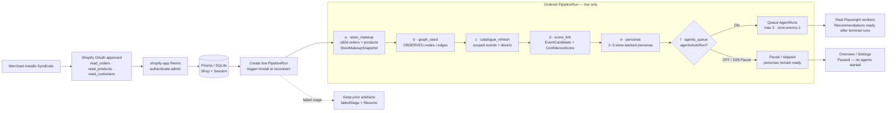
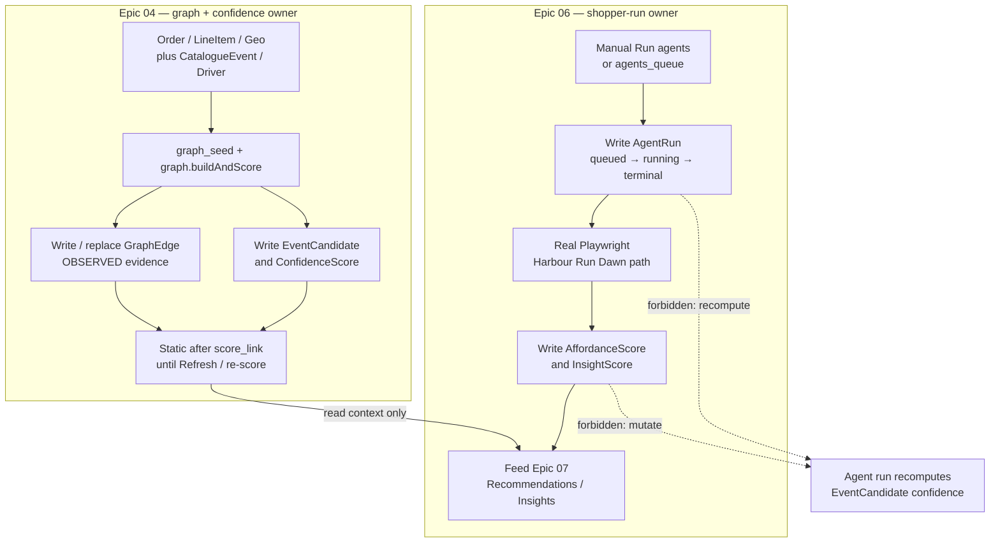

# Syndicate — whole-process flow diagrams

**Status:** **Source of truth (SoT) for the diagrams below**  
**Date:** 26 Sep 2026 · Europe/London (BST)  
**Vertical:** **Harbour Run / running** (football is a legacy or optional secondary fixture label)  
**Language:** British English  
**Product:** Syndicate Shopify Admin intelligence

These diagrams describe the locked weekend PoC, not a future production topology. They are deliberately centred on the **REAL PoC bar**:

- Admin is the `shopify-app/` Remix **Prisma Admin** surface whose loaders/actions read and write **Prisma/SQLite**.
- Merchant **Run agents** starts a real `AgentRun` and real headed Playwright shoppers against the Harbour Run storefront.
- A run stops before payment and its Insights cite the completed `agentRunId`.
- Vite `ui/*.html` is layout/visual reference only. Fixture JSON is seed input, not a primary-board loader and not the PoC happy path.

**Executive overview (two mermaids — product + process):** [`TOP_LEVEL_FLOW.md`](./TOP_LEVEL_FLOW.md) — start there for the Harbour Run weekend PoC spine; this file keeps the detailed A–E diagrams.

**Locked decision anchors:** [D26 Pause / agent cap](./RUN_AGENTS_UI_CONTRACT.md#locked-clarifications-do-not-reopen) · [LIVE_DATA_WIRE](./LIVE_DATA_WIRE.md) · [RUN_AGENTS_UI_CONTRACT](./RUN_AGENTS_UI_CONTRACT.md) · [LIVE_DEMO_GATE](./LIVE_DEMO_GATE.md) · [PLAN_HOLES_DELTA](./PLAN_HOLES_DELTA.md).

> **Mermaid rendering:** Mermaid blocks are normative diagrams. Actor names are logical boundaries, not a promise of separate deployable processes.

---

## A) Live install → OAuth → `PipelineRun` stages a→f

**Weekend catalogue hard path (D33):** stage `catalogue_refresh` DoD = **weather** + **race/running PROXY** + **social.hashtagTrends** (watchlist); webHarvest / virtual / activity / football soft-degrade — see `WEEKEND_SIGNAL_P0.md`.

Successful OAuth creates one ordered, idempotent live `PipelineRun`. The worker runs **a `store_makeup` → b `graph_seed` → c `catalogue_refresh` → d `score_link` → e `personas` → f `agents_queue`**. D26 means auto agents are capped at three and concurrency is one; Pause stops only the agent queue, not the preceding data stages.



**Live invariant:** loaders never fall back to a fixture board after OAuth. Every visible stage is a `PipelineRun` status; every Admin read is Prisma-backed. Payment, storefront writes, PCD beyond plan, unbounded swarms and live parkrun scraping do not start.

---

## B) Offline demo path: seed + demo pipeline → Prisma → Admin loaders

The offline path proves the vertical slice without a Partner store. It uses the same database and loader contract as live; `MOCK` is provenance on seeded rows, not permission to bypass Prisma.

```mermaid
flowchart LR
  F[Fixture JSON inputs<br/>Harbour Run seed pack<br/>labelled MOCK where applicable] --> S[npm run db:seed]
  S --> DB[(Prisma / SQLite<br/>same schema as live)]
  DB --> D[npm run pipeline:demo<br/>stages write demo shop rows]
  D --> DB

  DB --> L[shopify-app Remix<br/>Prisma-only loaders]
  L --> O[Admin Overview<br/>KPIs + pipeline state]
  L --> E[Admin Events<br/>ranked EventCandidates]
  L --> I[Admin Insights | Frictions<br/>Recommendations / artefacts]

  V[Vite ui/*.html<br/>layout reference only] -. never a loader .-> L
  J[Route-level fixture import<br/>forbidden] -. no bypass .-> L
```

**Run command:** `npm run db:seed && npm run pipeline:demo`. The demo may pre-seed database rows for rehearsal, but the Admin still renders from Prisma. It is not the REAL PoC happy path until a real headed shopper produces the cited `AgentRun` (see C and [LIVE_DEMO_GATE](./LIVE_DEMO_GATE.md)).

---

## C) Manual **Run agents** → real headed Playwright → stop before pay → Insights

This is the locked manual demo path. The button is an app action, not a Vite/localStorage simulation, MCP Todo task or Cursor Cloud Agent shopper. The worker binds each run to a Ready persona, the Harbour Run Dawn path, and the configured storefront URL. With D26 Pause ON, the button is disabled unless the documented **force headed demo** option is used; there is no silent no-op.

```mermaid
sequenceDiagram
  autonumber
  actor Merchant
  participant Admin as shopify-app Remix Admin
  participant Prisma as Prisma / SQLite
  participant Worker as App server worker
  participant PW as Headed Playwright Chromium
  participant Store as Harbour Run Online Store

  Merchant->>Admin: Click Run agents
  Admin->>Admin: authenticate.admin + validate URL / Ready persona
  Admin->>Prisma: Insert AgentRun queued<br/>personaId + path-harbour-run-dawn + storefront URL
  Admin-->>Merchant: Open Agent runs; poll status ~2s
  Worker->>Prisma: Claim AgentRun; status=running
  Worker->>PW: Launch headed browser<br/>guest path; no credentials or payment
  PW->>Store: Home → Race Kits → PDP → size → ATC → cart
  PW->>Store: Open checkout URL

  alt Checkout / payment boundary detected
    PW->>PW: Deny-list fires — STOP before pay<br/>no Pay / Buy it now / Shop Pay submit
    Worker->>Prisma: AgentRun stopped_before_payment<br/>outcome=checkout_started or carted
    Worker->>Prisma: Write AffordanceScore + InsightScore<br/>keyed by agentRunId
  else Stuck, missing variant, or price shock
    Worker->>Prisma: AgentRun completed<br/>outcome=abandoned + scores keyed by agentRunId
  else Timeout / browser error
    Worker->>Prisma: AgentRun failed + errorMessage
  end

  Worker->>Prisma: Recommendations / artefacts may reference agentRunId
  Merchant->>Admin: Open Insights | Frictions
  Admin->>Prisma: Load scores + recommendations + AgentRun.agentRunId
  Prisma-->>Admin: Cards cite the same completed AgentRun id
  Admin-->>Merchant: Insight with stop-before-pay + provenance
```

**REAL PoC acceptance:** a completed or `stopped_before_payment` real run, visible in Agent runs, plus agent-attributed Insights citing that run id. `fixtures/agents/demo-completed-run.json` is emergency/dev replay only and must carry a visible `MOCK` badge; it is never the happy path.

---

## D) Data-write ownership: Epic 04 vs Epic 06

The graph and occasion confidence are owned by Epic 04. **Admin Graph dashboard** (`/app/graph`, D34) reads the **same Prisma `GraphEdge` rows** as `score_link` / Events — never lab sqlite or Vite. Epic 06 observes the storefront and writes shopper-run evidence. **Agents do not recompute or mutate `EventCandidate` confidence.** A later Refresh/re-score may use its documented inputs, but an agent run is not that trigger.



| Owner | May write | Must not write as part of the other path |
|---|---|---|
| **Epic 04** (`graph_seed`, `score_link`) | `GraphEdge`, `EventCandidate`, `ConfidenceScore` from orders, catalogue, geo and store makeup | Shopper affordance/insight results; it does not run the storefront shopper |
| **Epic 06** (`agents_queue`, runner) | `AgentRun`, timeline/outcome, `AffordanceScore`, `InsightScore` | `GraphEdge`, `EventCandidate` or their confidence; no graph motion is faked from agent progress |
| **Epic 07** | Recommendations / artefacts derived from DB evidence and agent scores | Unattributed “agent-found” Insights without a real `agentRunId` |

---

## E) Dual-UI ban: layout reference vs Admin runtime

There is one Admin runtime. The Vite prototype is useful for visual QA and layout only; it is not a second demo app or data path.

```mermaid
flowchart LR
  V[Vite ui/*.html<br/>layout / IA / visual reference] -->|copy visual intent only| DEV[Builder implements routes]
  DEV --> A[shopify-app/ Remix<br/>embedded Shopify Admin — only runtime]
  A --> P[(Prisma / SQLite)]
  P --> O[Overview]
  P --> E[Events]
  P --> I[Insights | Frictions]
  P --> G[Graph · Prisma GraphEdge]
  P --> R[Agent runs]

  V -. forbidden .-> O
  V -. forbidden .-> E
  V -. forbidden .-> I
  V -. forbidden .-> G
  V -. forbidden .-> R
  LS[localStorage / sessionStorage<br/>fake runs] -. forbidden .-> R
```

**Ban:** do not ship or pitch Vite as Admin; do not load route-local fixture JSON for the primary board; do not simulate AgentRun progress in browser storage. The Admin must show the Prisma-backed rows produced by the live pipeline or the explicitly labelled offline seed path.

---

## Diagram cross-reference

| Diagram | Answers | Locked SoT |
|---|---|---|
| **TOP** | Executive product + runtime overview | [TOP_LEVEL_FLOW](./TOP_LEVEL_FLOW.md) |
| A | What live OAuth starts, and what stages a→f do | [AUTO_PIPELINE_ON_INSTALL](./AUTO_PIPELINE_ON_INSTALL.md), [D26 in RUN_AGENTS_UI_CONTRACT](./RUN_AGENTS_UI_CONTRACT.md) |
| B | How the no-Partner rehearsal reaches all three Admin boards | [LIVE_DATA_WIRE](./LIVE_DATA_WIRE.md) |
| C | What a real manual shopper run is and what the PoC must prove | [RUN_AGENTS_UI_CONTRACT](./RUN_AGENTS_UI_CONTRACT.md), [LIVE_DEMO_GATE](./LIVE_DEMO_GATE.md) |
| D | Which epic owns which database writes | [LIVE_DATA_WIRE](./LIVE_DATA_WIRE.md), [PLAN_HOLES_DELTA](./PLAN_HOLES_DELTA.md) |
| E | Why Vite and `shopify-app/` must never become dual Admins | [LIVE_DEMO_GATE](./LIVE_DEMO_GATE.md), [AGENT_KICKOFF](./AGENT_KICKOFF.md) |
