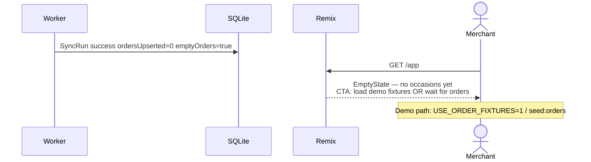
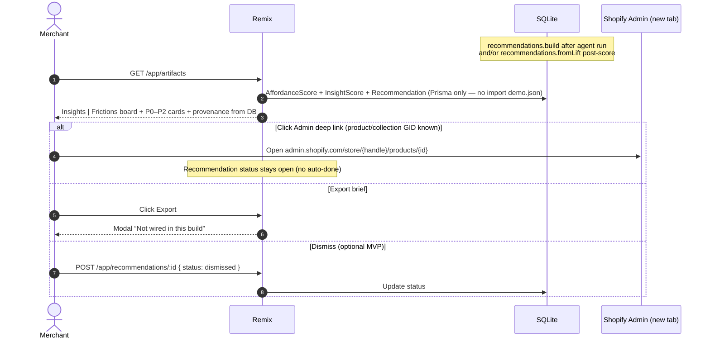
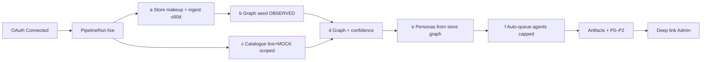

# SEQUENCE_INSTALL_TO_RECOMMENDATION — end-to-end flows

**Date:** 25 Sep 2026 · Europe/London  
**Locked MVP:** sports+athleisure · OAuth read_orders/products/customers · 60d ingest · football-data + Open-Meteo **forecast** + social watchlist/webHarvest/MOCK (D30/A15) · MOCK races/Hyrox · graph+agents · Playwright stop before pay · provenance labels · **auto pipeline on live connect** (store makeup → graph → personas → capped agents)

**Canonical auto-run spec:** [AUTO_PIPELINE_ON_INSTALL.md](./AUTO_PIPELINE_ON_INSTALL.md) — coding agents must not ask “should this auto-run?”  
**Canonical whole-process diagram SoT:** [FLOWS.md](./FLOWS.md) — use its Harbour Run / running diagrams for the live PoC, offline Prisma demo, real Run agents path, write ownership and dual-UI rule.

**UI read path (hard DoD):** every merchant screen below ends with `Remix → SQLite (Prisma)` — loaders never import fixture JSON for the primary board. Fixtures enter only via seed/pipeline write. See [LIVE_DATA_WIRE.md](./LIVE_DATA_WIRE.md).

Diagrams use [Mermaid](https://mermaid.js.org/) `sequenceDiagram`. Actors are logical (not process topology).

---

## Legend

| Actor | Role |
|-------|------|
| Merchant | Shopify Admin user |
| Shopify | Admin OAuth, GraphQL, webhooks |
| Remix | Embedded Syndicate app (loaders/actions) |
| Worker | Background jobs (`pipeline.run`, `jobs:ingest`, `jobs:catalogue`, `jobs:score`, `agents:run`) — **app workers**, not Cursor Cloud Agents at runtime (see CURSOR_TOOLING.md) |
| SQLite | Prisma store |
| FD | football-data.org API |
| OM | Open-Meteo API |
| Storefront | Online Store (Playwright target) |

---

---

## 0) AUTO PIPELINE (mandatory on live connect)

**Modes:** `demo` (fixtures only, no live jobs) vs `live` (after successful OAuth). Full field list, caps, and resume rules → [AUTO_PIPELINE_ON_INSTALL.md](./AUTO_PIPELINE_ON_INSTALL.md).

```mermaid
flowchart TD
  OAuth[OAuth success / reconnect] --> PR[Create PipelineRun trigger=install|reconnect]
  Manual[Settings: Refresh store + re-run] --> PR2[PipelineRun trigger=manual_refresh]
  PR --> A[a Store makeup snapshot]
  PR2 --> A
  A --> B[b Persist OBSERVED graph]
  B --> C[c Catalogue refresh scoped to geos/affinity]
  C --> D[d Confidence score + graph link]
  D --> E[e Materialise 2–3 personas]
  E --> F{agentsAutoRun on?}
  F -->|yes capped ≤3| G[f Queue AgentRuns concurrency=1]
  F -->|paused| H[Stop — personas ready; no agents]
  G --> I[Recommendations build]
  H --> J[Overview: personas ready · agents paused]
  I --> K[Recommendations ready]
```

**Does NOT auto-start:** unbounded agent swarms · payment · storefront writes · PCD beyond plan · parkrun scrape.

**UI strip:** Ingesting store makeup → Seeding graph → Refreshing events → Scoring occasions → Materialising personas → Agents running → Recommendations ready.

**Failure:** keep prior stage artifacts; Settings surfaces `failedStage` + Resume from last successful stage.

---

## 1) Install OAuth

```mermaid
sequenceDiagram
  autonumber
  actor Merchant
  participant Shopify
  participant Remix
  participant SQLite

  Merchant->>Shopify: Click Install (custom/dev link)
  Shopify->>Merchant: Scope grant UI<br/>(read_orders, read_products, read_customers)
  alt Merchant denies scopes
    Shopify-->>Merchant: Install aborted
    Note over Remix,SQLite: No Shop row; no token
  else Merchant approves
    Shopify->>Remix: Redirect / open embedded app (ID token)
    Remix->>Remix: authenticate.admin(request)
    alt ID token / exchange fails
      Remix-->>Merchant: Re-auth prompt (no blank crash)
      Note over Remix: Log errorCode=AUTH_FAIL; never log token
    else Auth OK
      Remix->>Shopify: Token exchange → offline access token
      Remix->>SQLite: Upsert Shop + Session<br/>(domain, scopes, storefrontUrl)
      Remix->>SQLite: Upsert PipelineRun trigger=install mode=live<br/>stages a→f pending (see AUTO_PIPELINE)
      Remix->>SQLite: Enqueue SyncRun + store makeup snapshot (stage a)
      Note over Remix,SQLite: Catalogue / graph / personas / agents<br/>queued by pipeline worker — not ad-hoc chaos
      Remix-->>Merchant: /app Overview · Connected · “Ingesting store makeup…”
      Note over Remix,SQLite: Fire-and-forget; UI polls PipelineRun status
    end
  end
```

**Failure path — auth fail:** No ingest. Top bar must not claim Connected. Settings shows “Not connected”. Retry = reopen app / reinstall.

**Failure path — uninstall mid-flight:**

```mermaid
sequenceDiagram
  participant Shopify
  participant Remix
  participant SQLite
  Shopify->>Remix: POST webhook APP_UNINSTALLED (HMAC)
  Remix->>Remix: Verify HMAC
  alt HMAC invalid
    Remix-->>Shopify: 401
  else Valid
    Remix->>SQLite: Invalidate Session; Shop.uninstalledAt=now
    Remix->>SQLite: Schedule PCD wipe (orders, geo, customerHash rows)
    Remix-->>Shopify: 200
  end
```

---

## 2) First ingest (≤60d orders + catalogue)

```mermaid
sequenceDiagram
  autonumber
  actor Merchant
  participant Remix
  participant Worker
  participant Shopify
  participant SQLite

  Note over Worker: Trigger: PipelineRun stage a (post-OAuth) OR Settings Refresh store + re-run
  Worker->>SQLite: SyncRun status=running
  loop Paginate until cursor null OR orders≥500
    Worker->>Shopify: Admin GraphQL orders (processedAt ≥ now-60d)
    alt HTTP 429
      Shopify-->>Worker: 429 + Retry-After
      Worker->>SQLite: SyncRun failed errorCode=HTTP_429
      Worker->>Worker: Backoff 30s → 2m → 10m
      Note over Remix,Merchant: Settings Banner + Retry (Epic 09)
    else GraphQL OK
      Shopify-->>Worker: Order page + lineItems + shippingAddress?
      alt PCD address fields null
        Worker->>Worker: Geo skip / fixture geo banner later
      else Address present
        Worker->>Worker: Sector normalise; never store street/email/phone
      end
      Worker->>SQLite: Upsert OrderRow, LineItemRow, Geo (OBSERVED)
    end
  end
  Worker->>Shopify: Admin GraphQL products + collections
  Shopify-->>Worker: Catalogue page
  Worker->>SQLite: Upsert ProductRow, CollectionRow, ProductCollection
  Worker->>SQLite: Build StoreMakeupSnapshot (collections/tags/types,<br/>SKU mix, geo buckets, price bands, top collections)
  Worker->>SQLite: SyncRun success + counts; PipelineRun stage a = success
  Worker->>SQLite: Advance pipeline → stage b graph_seed then catalogue/score
  Merchant->>Remix: GET /app or /app/settings
  Remix->>SQLite: Latest SyncRun meta (+ Overview KPIs from DB when pipeline advanced)
  Remix-->>Merchant: “Last sync · N orders” · KPIs from Prisma not static HTML
```

**Failure path — empty shop (zero orders):**



**Idempotency:** OrderRow.id = Shopify GID; re-run upserts, no duplicate PKs.

---

## 3) Event catalogue job tick

> **Diagram scope note:** This catalogue sequence includes football-data.org only as an optional/secondary signal source. The primary vertical is Harbour Run / running; for the current whole-process view use [FLOWS.md](./FLOWS.md).

```mermaid
sequenceDiagram
  autonumber
  participant Worker
  participant FD as football-data.org
  participant OM as Open-Meteo
  participant SQLite

  Note over Worker: Boot + 6h fixtures / 3h weather.forecastLocal / 6h social.hashtagTrends; mock seed once per deploy

  Worker->>SQLite: CatalogueJobRun mock_sports_seed running
  Worker->>SQLite: Upsert MOCK CatalogueEvents (races, Hyrox, parkrun-shaped, virtual, season drop)
  Worker->>SQLite: mock seed success

  alt FOOTBALL_DATA_TOKEN set
    Worker->>FD: GET /v4/competitions/PL/matches?dateFrom&dateTo
    alt 429 / 5xx after retries
      FD-->>Worker: error
      Worker->>Worker: Circuit OPEN 1h
      Worker->>SQLite: Job failed; keep last-good; stale flags
      Note over SQLite: UI banner: Calendar source degraded
    else 200
      FD-->>Worker: matches[]
      Worker->>SQLite: Upsert CatalogueEvent team_fixture OBSERVED<br/>naturalKey dedupe (prefer live over MOCK overlap)
    end
  else No token
    Worker->>SQLite: Skip live; warning log; MOCK fixtures only
  end

  Worker->>SQLite: Resolve top ≤3–5 GeoBuckets (orders Geo or London/Manchester/Birmingham defaults)
  Worker->>OM: weather.forecastLocal GET 7-day daily=... timezone=Europe/London
  alt OM fail
    OM-->>Worker: error
    Worker->>SQLite: Weather job failed; no wipe; keep last-good WeatherForecast; optional MOCK labelled
  else 200
    OM-->>Worker: daily series (7d)
    Worker->>SQLite: Upsert WeatherForecast OBSERVED per geo×day
    Worker->>Worker: Spike? wet weekend / tMin≤3 / tMax≥28 / wind≥45
    Worker->>SQLite: Upsert Driver AGGREGATE_PROXY (spike interpretation)
  end

  Worker->>SQLite: social.hashtagTrends load hashtag-watchlist.json
  Worker->>Worker: social.webHarvest fetch allowlist public pages (robots.txt)
  alt Harvest OK
    Worker->>SQLite: Upsert SocialTrend AGGREGATE_PROXY from public pages<br/>(never OBSERVED demand from social alone)
  else Harvest blocked / empty
    Worker->>SQLite: Upsert HashtagWatch + SocialTrend MOCK from fixtures
  end
  Note over Worker: Optional official X/Reddit APIs = P2 only if keys later — not required (A15)
```

**Failure path — crawl fail:** Never blocks Shopify ingest. Dashboard shows last-good + degraded banner. parkrun.com must never be fetched.

---

## 4) Score + persona mint

```mermaid
sequenceDiagram
  autonumber
  participant Worker
  participant SQLite
  participant Remix
  actor Merchant

  Note over Worker: Trigger: PipelineRun stages d–e (after graph_seed + catalogue) OR Settings recompute

  Worker->>SQLite: Read OrderRow/LineItem/Geo + CatalogueEvent/Driver + WeatherForecast/SocialTrend
  Worker->>SQLite: Upsert GraphEdges CONTAINS, SHIPPED_TO, VENUE_IN, DRIVEN_BY, AFFINITY, GEO_OVERLAP
  Worker->>Worker: Candidate gen (catalogue windows + orders_only spikes)
  Worker->>Worker: C(E)=clip(0.30Lt+0.25G+0.25A+0.10Y+0.10R)
  Worker->>Worker: low-n cap 0.40 if n_W&lt;5; softmax multi-event day
  Worker->>SQLite: Replace EventCandidate + ConfidenceScore for shop (idempotent)
  Worker->>Worker: personas.derive — AOV bands, goals from baskets, fashion stub
  Worker->>SQLite: Upsert Persona + PERSONA_OF / GOALS_INCLUDE edges
  Merchant->>Remix: GET /app/events · /app/personas
  Remix->>SQLite: listEventCandidates / listPersonas (Prisma only — LIVE_DATA_WIRE)
  Remix-->>Merchant: Harbour Run occasions ranked from DB · personas Ready/Draft · fashion stub
```

**Failure path — insufficient signal:** Zero EventCandidates → empty Events; **no hallucinated personas** (stub fashion only if shop exists). Overview EmptyState.

---

## 5) Run agents

```mermaid
sequenceDiagram
  autonumber
  actor Merchant
  participant Remix
  participant SQLite
  participant Worker
  participant Storefront

  alt Auto (PipelineRun stage f) — default on live
    Worker->>SQLite: Personas Ready after stage e
    Worker->>SQLite: Insert AgentRun queued per Ready persona<br/>(cap 3; skip if agentsAutoRun=false)
    Note over Remix,Merchant: Overview: “Agents running…” — named trigger=pipeline
  else Manual
    Merchant->>Remix: POST /app/runs { personaIds?: string[] }
    Remix->>Remix: authenticate.admin
    Remix->>SQLite: Insert AgentRun queued for each Ready persona (default all Ready)
    Remix-->>Merchant: toast “Agents queued…” · optional redirect /app/runs/:id
  end

  loop Poll every 2s while running
    Merchant->>Remix: GET /app/runs/:id
    Remix->>SQLite: progressPct, timelineJson, status
    Remix-->>Merchant: Timeline UI
  end

  Worker->>SQLite: Claim next queued (concurrency=1)
  Worker->>SQLite: status=running startedAt=now
  Worker->>Worker: Launch Playwright · viewport from persona
  Worker->>Storefront: GET home → collection → PDP → size → ATC → cart → checkout URL

  alt Checkout page detected
    Worker->>Worker: STOP — deny-list Pay / Buy it now / Shop Pay submit
    Worker->>SQLite: AffordanceScore[] + outcome=checkout_started|carted
    Worker->>SQLite: status=completed progressPct=100 timeline≥5 steps
    Worker->>SQLite: Enqueue recommendations.build(shopId, runId)
  else Stuck URL×3 / missing variant / price shock
    Worker->>SQLite: InsightScore + outcome=abandoned
    Worker->>SQLite: status=completed (abandoned is valid completion)
  else Timeout 180s / Playwright crash
    Worker->>SQLite: status=failed errorMessage outcome=failed
    Note over Remix,Merchant: Critical Banner on run detail; no payment side effects
  end
```

**Failure path — agent timeout / flaky theme:** Use `fixtures/agents/demo-completed-run.json` hydrate with provenance **MOCK** + UI badge “Replay (mock)” so pitch continues.

**Hard invariant:** Guest path only; never submit email/password/payment.

---

## 6) Recommendation card click



**Failure path — no agent scores yet:** Show merch/collection cards from lift only if `fromLift` ran; else EmptyState “Run agents to generate resonates & insights.”

---

## 7) Roll-up: install → recommendation (happy path)



**Invariant:** live OAuth must not strand the merchant on empty fixture Overview — PipelineRun always starts.

**Invariant (LIVE_DATA_WIRE):** at every UI step above, Remix loaders read **SQLite via Prisma**. `DEMO_FIXTURE_SHOP=1` seeds the same tables; it does not bypass loaders with route-local JSON.

**Demo SLA:** Overview → Event → Persona → Run → Artifacts narratable in **≤7 minutes** (see `DEMO_SCRIPT.md`).

---

## Timing expectations (hackathon)

| Step | Typical | Soft ceiling |
|------|---------|--------------|
| OAuth → Overview shell + PipelineRun queued | &lt; 15s | 60s |
| Stage a — makeup + ingest (≤500 orders) | 30s–3m | 10m then Banner |
| Stages b–c — graph seed + catalogue | 10–60s | 3m + degraded OK |
| Stages d–e — score + personas | 2–20s | 60s |
| Stage f — single agent run (auto, concurrency 1) | 30–120s | 180s fail |
| Recommendations build | &lt; 5s | 30s |
| Full live PipelineRun a→f (2 personas) | 2–8m | 15m then partial Banner |
