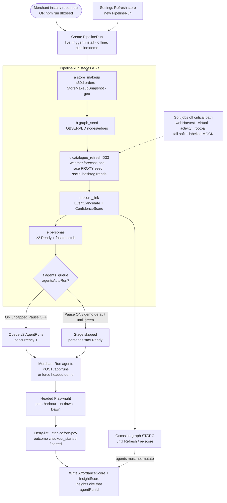
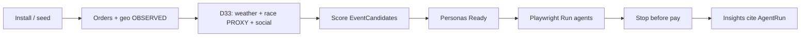
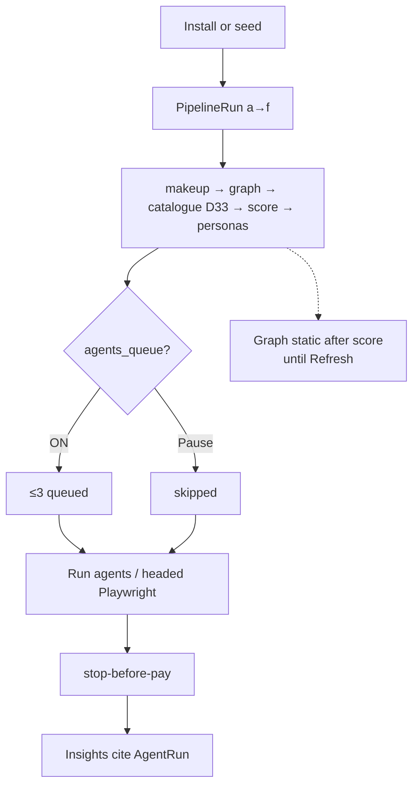

# TOP_LEVEL_FLOW — Harbour Run weekend PoC (executive)

**Date:** 26 Sep 2026 · Europe/London (BST)  
**Vertical:** Running / Harbour Run primary  
**Catalogue DoD (D33):** weather + race/running PROXY + `social.hashtagTrends` only  
**PoC bar:** Prisma Admin · real headed Playwright `AgentRun` · Insights cite that run id  
**Companions:** [`FLOWS.md`](./FLOWS.md) (detailed A–E) · [`WEEKEND_SIGNAL_P0.md`](./WEEKEND_SIGNAL_P0.md) · [`LIVE_DEMO_GATE.md`](./LIVE_DEMO_GATE.md)

This page is the **executive overview**. Detailed sequences live in FLOWS.md.

**Provenance (light):** orders = **OBSERVED** · race calendar = **PROXY/MOCK** · weather payload = **OBSERVED** · weather spike Driver = usually **AGGREGATE_PROXY** · social watchlist = **MOCK/AGGREGATE_PROXY** (never OBSERVED demand alone).

---

## 1) Product — what we build (merchant-facing whole product)

Install/seed → makeup/orders+geo → D33 catalogue → score EventCandidates → personas → Run agents (Playwright) → stop-before-pay → Insights | Frictions.

```mermaid
flowchart LR
  subgraph IN[In]
    I[Install OAuth<br/>or offline seed]
  end

  subgraph DATA[Data spine]
    M[Makeup · orders + geo<br/>OBSERVED]
    C[Catalogue D33<br/>weather OBS · race PROXY · social watch]
    S[Score EventCandidates<br/>join OBS × weather × geo × race]
    P[Personas Ready<br/>Race-day taper · Wet-weather]
  end

  subgraph WOW[Shopper wow]
    R[Run agents<br/>Playwright shoppers]
    X[Stop before pay]
    Y[Insights \| Frictions<br/>cite AgentRun id]
  end

  I --> M --> C --> S --> P --> R --> X --> Y

  Soft[Soft-degrade<br/>webHarvest · virtual · activity · football] -. not DoD .-> C
  Vite[Vite ui/*.html<br/>layout only] -. never Admin .-> Y
```

---

## 2) Process — how it runs (runtime)

Install **or** offline seed → `PipelineRun` a→f → optional / manual **Run agents** → headed Playwright → stop-before-pay → Insights cite `AgentRun`. Graph is **static after score** until Refresh / re-score; **Admin Graph** (`/app/graph`, D34) reads the same Prisma `GraphEdge` rows as `score_link`. Soft catalogue jobs stay off the critical path.



---

## Chat-paste short forms

### Product (compact)



### Process (compact)



---

## Locks (do not reopen)

- Running / Harbour Run primary · D33 hard catalogue cut  
- Agents = Playwright shoppers · Cloud Agents = **build only**  
- Graph not recomputed by agents · Refresh re-runs pipeline · Admin Graph reads same Prisma edges as score_link (D34)  
- REAL PoC only — no MOCK happy path · no Vite-as-Admin  
